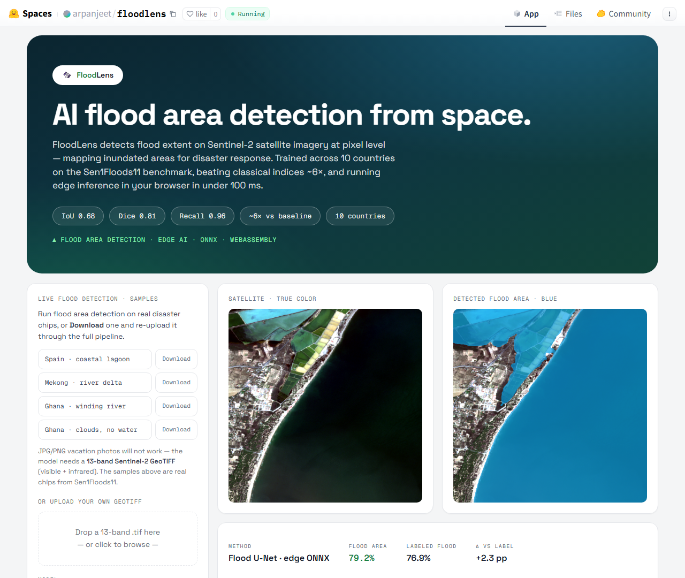
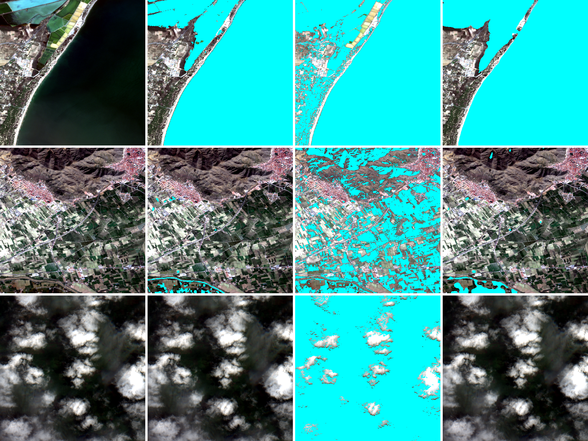
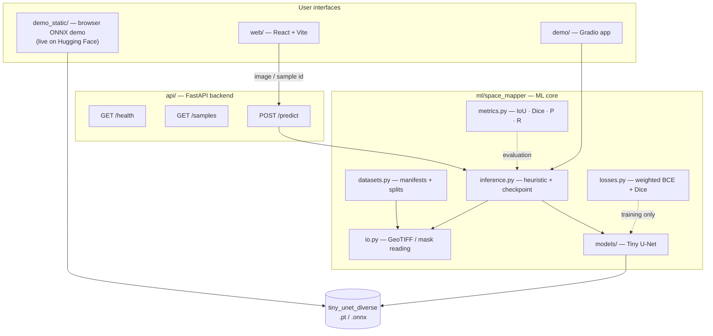
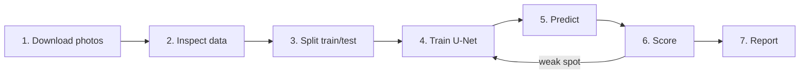
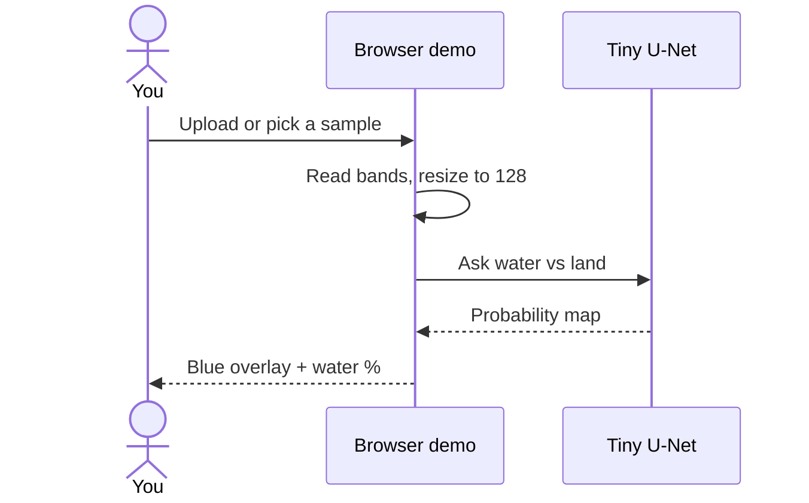
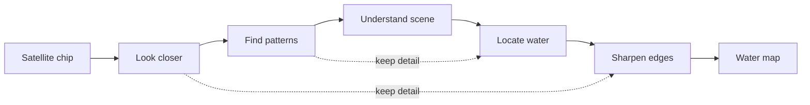
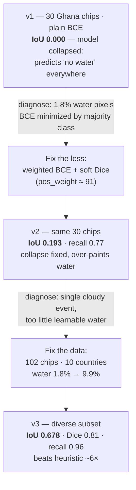

# FloodLens

**Deep Learning Flood Area Detection from Sentinel-2 Optical Imagery**

> **Live Demo**: Try the edge-deployed ONNX model in your browser here: [FloodLens on Hugging Face Spaces](https://huggingface.co/spaces/arpanjeet/floodlens)
> 
> 

Classical water indices (like NDWI) often fail across diverse geographic regions and varying cloud covers. FloodLens learns robust flood signatures from the Sen1Floods11 dataset and provides a live inference pipeline that runs entirely in-browser via WebAssembly, eliminating the need for GPU-backed servers during inference.

Inspired by NASA/IBM **Prithvi** geospatial workflows and the ImpactMesh multi-hazard framework.

---

## Results at a glance

Trained on a **102-chip, 10-country** subset of Sen1Floods11 (Sentinel-2 optical, 13-band).
Held-out test set = 15 chips.

| Method | IoU ↑ | Dice/F1 ↑ | Precision | Recall |
|---|---|---|---|---|
| Heuristic baseline (NDWI-like) | 0.108 | 0.195 | 0.110 | 0.858 |
| **Tiny U-Net** (weighted BCE + Dice) | **0.678** | **0.808** | **0.699** | **0.958** |



*Columns: **satellite RGB · ground-truth water · heuristic prediction · Tiny U-Net prediction**
(water in cyan). Rows: a Spanish coastal lagoon (76% water), a barely-flooded valley (1.3%),
and a cloud-covered chip with no water. The U-Net (rightmost) tracks the truth closely —
including correctly predicting **almost no water** on the cloudy, water-free chip, showing it
did not simply learn "always predict water."*

---

## System architecture

Two front ends share one ML core. The **live demo** is the static browser app (`demo_static/`);
Gradio and React+FastAPI are optional local UIs.



## Data & experiment pipeline



## How a prediction flows



## Tiny U-Net architecture



---

## The story (how the result was earned)

The interesting part isn't the final number — it's the trail of measured decisions:



| Version | Data | Loss | IoU | What it taught us |
|---|---|---|---|---|
| v1 | 30 chips, all Ghana | plain BCE | **0.000** | With ~1.8% water pixels, plain cross-entropy is minimized by predicting "no water" everywhere. |
| v2 | 30 chips, all Ghana | weighted BCE + Dice | **0.193** | An imbalance-aware loss stops the collapse. |
| **v3** | **102 chips, 10 countries** | weighted BCE + Dice | **0.678** | Diverse, less-imbalanced data turns a working pipeline into a strong result. |

Two changes drove it, **each verified by re-measuring**:
1. **Loss:** `BCE` → `weighted BCE + soft Dice` → IoU 0.00 → 0.19 on identical data.
2. **Data:** single cloudy event → 10-country diverse subset → IoU 0.19 → 0.68.

The full derivation (why the collapse happens, the gradient math, the fix) is in
[`docs/ml_math_explained.md`](docs/ml_math_explained.md) — written as beginner-friendly ML notes.

---

## Live demo

**Try it now:** [huggingface.co/spaces/arpanjeet/floodlens](https://huggingface.co/spaces/arpanjeet/floodlens)

No signup. Click a sample chip (Spain / Mekong / Ghana), or **Download** one and re-upload it
to walk the same path a real user would. The ~0.5 MB U-Net runs **entirely in your browser**
(ONNX + WebAssembly). Source: `demo_static/`.

Also available locally:
- **Static demo (same as the Space):** open `demo_static/index.html` via a local static server
- **Gradio version:**
  ```powershell
  ml\.venv\Scripts\python.exe demo\app.py
  # then open the http://127.0.0.1:7860 link it prints
  ```

---

## Project structure

```
Space Project/
├── ml/                      ML core (Python package + CLIs)
│   ├── space_mapper/
│   │   ├── datasets.py      manifests, splits, PyTorch dataset
│   │   ├── io.py            GeoTIFF / image / mask reading
│   │   ├── models/          Tiny U-Net
│   │   ├── losses.py        weighted BCE + soft Dice
│   │   ├── metrics.py       IoU, Dice/F1, precision, recall
│   │   ├── inference.py     heuristic + checkpoint prediction
│   │   └── cli/             prepare_sample_manifest, train_baseline,
│   │                        predict_sample, evaluate_predictions
│   └── requirements.txt
├── api/                     FastAPI backend
├── web/                     React + Vite front end
├── demo/                    Gradio app (for Hugging Face Space)
├── scripts/                 helper scripts (download, train pipeline, packaging)
├── docs/                    research notes + ML math explainer + assets
└── data/                    LOCAL ONLY (gitignored): datasets, models, results
```

> **Not committed** (see `.gitignore`): the `data/` folder, datasets (`*.tif`), and model
> checkpoints (`*.pt`). Satellite data is large and models are reproducible — clone the repo
> and run the Quickstart below to regenerate them.

---

## Quickstart (Windows / PowerShell)

### 1. Set up the ML environment
```powershell
cd "Z:\Projects\Space Project\ml"
py -3.12 -m venv .venv
.\.venv\Scripts\python.exe -m pip install -r requirements.txt
.\.venv\Scripts\python.exe -m pip install rasterio
.\.venv\Scripts\python.exe -m pip install torch --index-url https://download.pytorch.org/whl/cpu
```
(Use a CUDA build of `torch` instead to train on a GPU.)

### 2. Download a data subset (public, no login)
```powershell
cd "Z:\Projects\Space Project"
.\scripts\download_sen1floods11_subset.ps1          # ~80 chips across 10 countries
```
Files land in `data\raw\sen1floods11\{images,masks}\` (gitignored).

### 3. Build a manifest
```powershell
cd ml
.\.venv\Scripts\python.exe -m space_mapper.cli.prepare_sample_manifest `
  --images ..\data\raw\sen1floods11\images `
  --masks  ..\data\raw\sen1floods11\masks `
  --output ..\data\manifests\sen1floods11_diverse.csv
```

### 4. Train the Tiny U-Net
```powershell
.\.venv\Scripts\python.exe -m space_mapper.cli.train_baseline `
  --manifest ..\data\manifests\sen1floods11_diverse.csv `
  --output artifacts\tiny_unet_diverse.pt `
  --epochs 30 --batch-size 8 --loss bce_dice --pos-weight auto
```

### 5. Evaluate (heuristic vs U-Net) and make the figure
```powershell
cd "Z:\Projects\Space Project"
$env:PYTHONPATH="$PWD\ml"
ml\.venv\Scripts\python.exe scripts\run_pipeline.py `
  --split test --manifest data\manifests\sen1floods11_diverse.csv `
  --checkpoint ml\artifacts\tiny_unet_diverse.pt --tag _diverse
ml\.venv\Scripts\python.exe scripts\make_comparison.py `
  --manifest data\manifests\sen1floods11_diverse.csv --out data\results\comparison_diverse.png
```

### 6. Run the demo
```powershell
ml\.venv\Scripts\python.exe demo\app.py
```

---

## How the model works (short version)

- **Task:** semantic segmentation — label every pixel water / not-water.
- **Baseline:** a fixed **NDWI-like** index (`(green − NIR)/(green + NIR)`) — no learning; the
  floor to beat.
- **Model:** a **Tiny U-Net** — encoder–decoder CNN with skip connections (diagram above).
- **Loss:** **weighted BCE + soft Dice** — makes the rare water class count and optimizes overlap
  directly, avoiding majority-class collapse.
- **Optimizer:** AdamW. **Metrics:** IoU, Dice/F1, precision, recall (accuracy is intentionally
  *not* headlined — it is misleading under class imbalance).

Full math and intuition: [`docs/ml_math_explained.md`](docs/ml_math_explained.md).

---

## Dataset & license

- **Sen1Floods11** — Bonafilia, D., Tellman, B., Anderson, T., Issenberg, E. (2020).
  *Sen1Floods11: a georeferenced dataset to train and test deep learning flood algorithms for
  Sentinel-1.* CVPR 2020 Workshops, pp. 210–211.
- Source: public Google Cloud bucket `gs://sen1floods11/v1.1` (downloaded over HTTPS).
- The dataset is redistributed under its own terms; this repo does **not** bundle it — it is
  downloaded locally at runtime.

## Honest limitations

- Small subset (102 chips) and **optical-only** — clouds hide water in some scenes.
- Test set is 15 chips, so metrics have real variance; treat them as indicative.
- Precision 0.70 → the model still over-paints water in places.

## Roadmap

- [ ] Scale up chip count; train on GPU (RTX 5050 / CUDA build).
- [ ] Add **Sentinel-1 (radar)** inputs, which see through cloud — the dataset's primary task.
- [ ] Threshold/probability calibration to raise precision.
- [ ] **Prithvi** foundation-model reference comparison.
- [ ] ImpactMesh flood-vs-wildfire extension.

## Acknowledgements

Built on the Sen1Floods11 benchmark and inspired by NASA/IBM Prithvi and ImpactMesh research.
Implementation, evaluation, and demo by [Arpanjeet Singh](https://github.com/arpan-s-dev).

## License

MIT (code). Dataset and any third-party model weights remain under their respective licenses.
